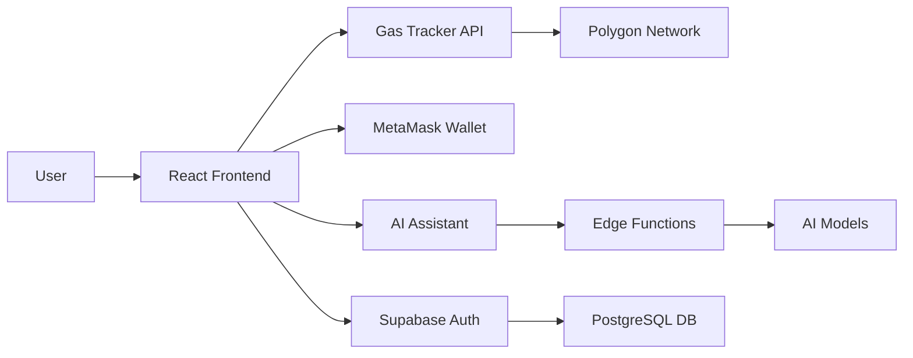

# PolyGas - Polygon Gas Tracker & Optimizer 🚀

<div align="center">
  
  
  **Never overpay on gas fees again!**
  
  [](https://polygon.technology/)
  [](https://reactjs.org/)
  [](https://www.typescriptlang.org/)
</div>

---

## 🌟 What is PolyGas?

**PolyGas** is a professional, production-ready web application that helps Polygon network users optimize their transaction costs by tracking real-time gas prices and providing intelligent scheduling capabilities. Built for traders, NFT enthusiasts, dApp developers, and anyone who wants to save money on Polygon transactions.

### 💡 Why PolyGas?

The Polygon network's gas prices fluctuate throughout the day. Executing transactions during peak times can cost you **up to 70% more** than off-peak times. PolyGas solves this problem by:

- **Real-time monitoring** of Polygon gas prices (updates every 5 seconds)
- **Smart scheduling** to execute transactions when prices drop
- **AI-powered insights** for optimal transaction timing
- **Historical analytics** to identify patterns and trends
- **Cost estimation** in both Gwei and USD

---

## 🚀 Key Features

### 1. **Real-Time Gas Tracking Dashboard**
- Live gas price monitoring with 5-second updates
- Three speed tiers: Slow, Standard, Fast
- Interactive charts showing historical trends
- Price comparison graphs
- Network congestion indicators

### 2. **Transaction Scheduler**
- Set custom gas price limits
- Automatic execution when prices drop below threshold
- Queue management for multiple transactions
- Status tracking (pending/executed)
- Email notifications (coming soon)

### 3. **AI-Powered Gas Assistant**
- Get intelligent recommendations for best transaction times
- Ask questions about gas optimization strategies
- Analyze historical patterns with AI
- Personalized insights based on your transaction history
- Powered by advanced language models

### 4. **Wallet Integration**
- Seamless MetaMask connection
- Real-time wallet balance display
- Polygon network detection
- Transaction signing capabilities
- Non-custodial (your keys never leave your device)

### 5. **User Authentication**
- Secure email authentication
- Protected dashboard access
- User-specific transaction history
- Personalized settings and preferences
- Password reset functionality

### 6. **Pricing Plans**
- **Free Plan**: 10 gas scans per day, basic tracking
- **Pro Plan**: Unlimited scans, AI assistant, priority scheduling
- **Enterprise Plan**: API access, custom alerts, dedicated support

---

## 🛠️ Technology Stack

### Frontend
- **React 18** - Modern UI library
- **TypeScript** - Type-safe development
- **Vite** - Lightning-fast build tool
- **Tailwind CSS** - Utility-first styling
- **shadcn/ui** - Beautiful, accessible components
- **Recharts** - Data visualization
- **Framer Motion** - Smooth animations

### Backend & Cloud
- **Lovable Cloud** - Serverless backend infrastructure
- **Supabase** - Database & authentication
- **Edge Functions** - Serverless API endpoints
- **PostgreSQL** - Relational database

### Web3
- **ethers.js** - Ethereum/Polygon interaction
- **MetaMask** - Wallet provider
- **PolygonScan API** - Gas price data (mock in demo)

### AI & Machine Learning
- **Lovable AI** - AI-powered insights
- **OpenAI GPT-4** - Natural language processing
- **Google Gemini** - Advanced reasoning

---

## 📊 How It Works

### For End Users:

1. **Sign Up & Connect**
   - Create a free account
   - Connect your MetaMask wallet
   - Start tracking gas prices immediately

2. **Monitor & Analyze**
   - View real-time gas prices on the dashboard
   - Check historical charts to identify trends
   - Use AI assistant to get recommendations

3. **Schedule Transactions**
   - Set your maximum gas price limit
   - Enter transaction details (recipient, amount)
   - System automatically executes when price drops

4. **Save Money**
   - Save up to 70% on gas fees
   - Get notifications when prices are optimal
   - Track your total savings over time

### Technical Flow:



---

## 🚦 Getting Started

### Prerequisites
- Node.js 18+ and npm
- MetaMask browser extension
- Polygon network added to MetaMask

### Installation

```bash
# Clone the repository
git clone <YOUR_GIT_URL>

# Navigate to project directory
cd polygas

# Install dependencies
npm install

# Set up environment variables
cp .env.example .env

# Start development server
npm run dev
```

The app will be running at `http://localhost:5173`

### Environment Variables

Create a `.env` file (auto-generated by Lovable Cloud):

```env
VITE_SUPABASE_URL=your_supabase_url
VITE_SUPABASE_ANON_KEY=your_supabase_anon_key
```

---

## 🌐 Deployment

### Deploy to Vercel (Recommended)

PolyGas is optimized for Vercel deployment:

1. **Using Vercel CLI:**
```bash
# Install Vercel CLI
npm i -g vercel

# Deploy
vercel
```

2. **Using Vercel Dashboard:**
   - Push your code to GitHub
   - Import the repository in Vercel
   - Vercel auto-detects Vite configuration
   - Add environment variables
   - Deploy!

3. **Build Configuration (Automatic):**
   - Build Command: `npm run build`
   - Output Directory: `dist`
   - Install Command: `npm install`

### Deploy via Lovable

Simply open [Lovable](https://lovable.dev/projects/9691f644-5057-4f39-b589-7f7463ee9e52) and click **Share → Publish**.

### Other Platforms
- **Netlify**: `npm run build` → deploy `dist` folder
- **Cloudflare Pages**: Connect GitHub repo
- **AWS Amplify**: Point to GitHub repository
- **Railway**: One-click deploy from GitHub

---

## 🎨 Features Overview

### Dashboard
- Real-time gas price cards (Slow/Standard/Fast)
- Live updating charts (5-second intervals)
- Price trend indicators
- USD cost estimation
- Network status monitoring

### Scheduler
- Transaction queue management
- Gas price limit setting
- Automatic execution triggers
- Status tracking
- Delete/cancel functionality

### AI Assistant
- Natural language queries
- Gas optimization advice
- Historical pattern analysis
- Best time recommendations
- Custom insights

### Pricing
- Transparent tier comparison
- Free trial available
- Pay-as-you-grow model
- Enterprise solutions

---

## 🔒 Security

- **Non-custodial**: Your private keys never leave your device
- **Encrypted**: All data encrypted at rest and in transit
- **Secure Auth**: Email verification + password hashing
- **RLS Policies**: Row-level security on database
- **Open Source**: Transparent, auditable code

---

## 🤝 Use Cases

### For Traders
- Execute trades during low-gas periods
- Maximize profit margins on arbitrage
- Reduce slippage from high gas costs

### For NFT Collectors
- Mint NFTs when gas is cheapest
- List items at optimal times
- Save on bulk transactions

### For dApp Developers
- Optimize smart contract deployments
- Schedule batch operations
- Reduce operational costs

### For DAOs
- Execute governance transactions efficiently
- Batch token distributions
- Optimize treasury management

---

## 📈 Roadmap

- [ ] Real PolygonScan API integration
- [ ] Email/SMS notifications for price alerts
- [ ] Mobile app (iOS & Android)
- [ ] Multi-chain support (Ethereum, BSC, Arbitrum)
- [ ] Advanced analytics dashboard
- [ ] API for developers
- [ ] Browser extension
- [ ] Telegram/Discord bot

---

## 🧪 Development

### Project Structure
```
polygas/
├── src/
│   ├── components/       # React components
│   ├── pages/           # Route pages
│   ├── integrations/    # Supabase client
│   ├── hooks/           # Custom React hooks
│   └── lib/             # Utility functions
├── supabase/
│   └── functions/       # Edge functions
└── public/              # Static assets
```

### Available Scripts

```bash
npm run dev          # Start dev server
npm run build        # Build for production
npm run preview      # Preview production build
npm run lint         # Run ESLint
```

### Contributing

We welcome contributions! Please:
1. Fork the repository
2. Create a feature branch
3. Make your changes
4. Submit a pull request

---

## 📄 License

This project is built with Lovable and is open for learning and modification.

---

## 🌐 Links

- **Live Demo**: [PolyGas App](https://lovable.dev/projects/9691f644-5057-4f39-b589-7f7463ee9e52)
- **Polygon Network**: [polygon.technology](https://polygon.technology/)
- **Documentation**: [Lovable Docs](https://docs.lovable.dev)

---

## 💬 Support

- **Email**: support@polygas.app
- **Discord**: Join our community
- **Twitter**: @PolyGasApp

---

<div align="center">
  <p><strong>Built with ❤️ on Polygon</strong></p>
  <p>Empowering the Polygon community with smart gas optimization</p>
</div>
